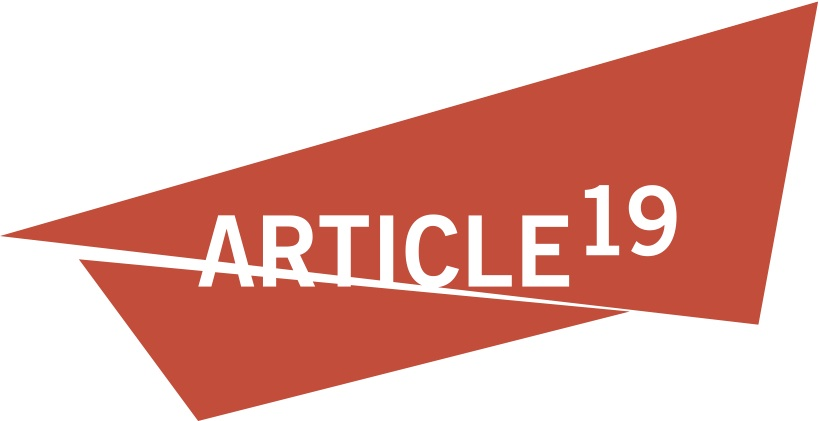
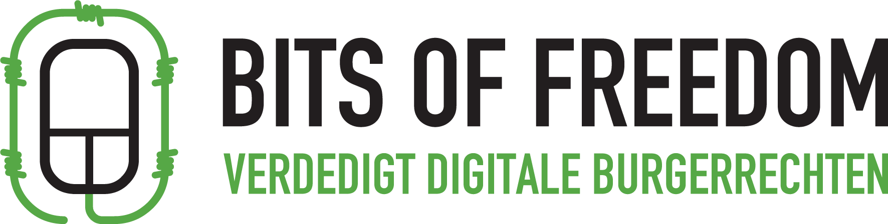
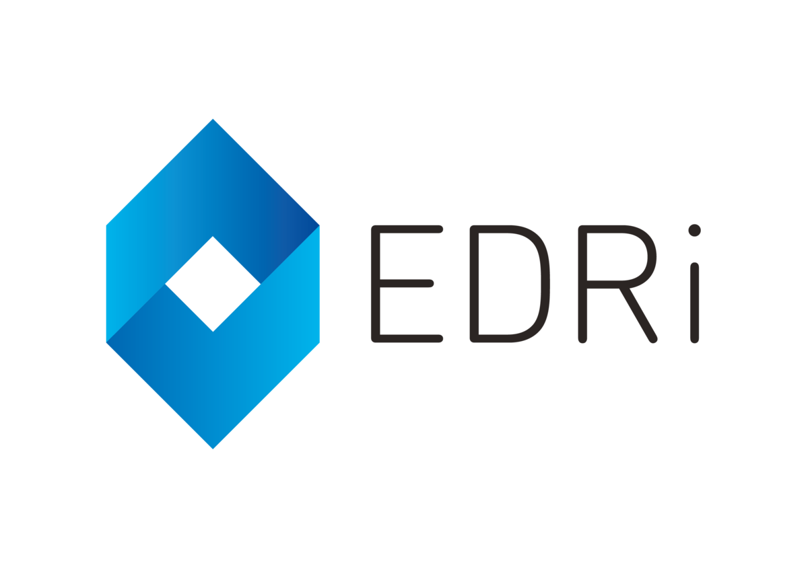
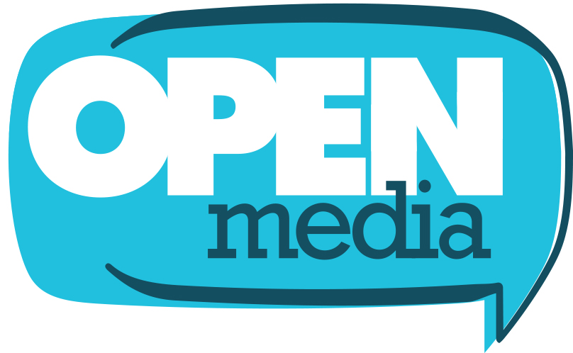
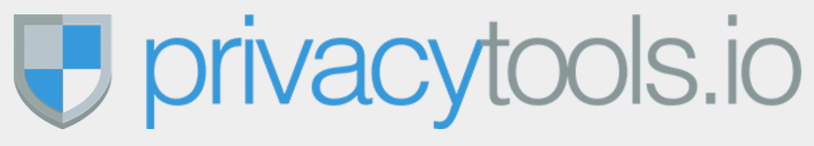
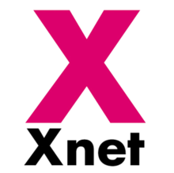

{::options auto_ids="false" /}
{::options parse_block_html="true" /} 

# We are concerned about how the rollback of Title II net neutrality could negatively impact the world’s shared Internet ecosystem.

* [Businesses](#businesses)
* [Sign On](#signon)
{: class="hide" }

<a href="#letter" class="button">Read the letter</a>

---

## Businesses & Organizations
{: #businesses }

* 
* 
* 
* 
* 
* 
* 
* 
* 
* 
* 
* 
{: #anchor-businesses }

* 4Choice.com
* ad'lead
* Aiden
* AIL Group
* ajhenke.com
* AKM
* Albold Consulting GmbH
* Alpen Adria University Klagenfurt
* Ambulantes OP-Zentrum Regensburg
* APA System and Vision GmbH
* Aqua Slug Services Inc.
* Aranica AS
* Architektur
* Arnold Holste Wwe. GmbH & Co. KG
* Arnulf Krandick
* ARTICLE 19
* AS Wasserkabel Baltic
* Atelier
* Atelier für Kunst und Lebenskunst
* Awkward
* B&N Software GmbH
* Bavaria Pensionsmanagement GmbH
* bbp-consulting
* BDP Hamburg
* Berner Fachhochschule, E-Government-Institut
* BestVPN.com
* bewowuppertal
* Bhend Oehrli
* Bits of Freedom
* BLEevents
* BO Wbg
* Bold and Open
* Bond Ltd.
* Borna Arbeits- und Wohngemeinschaft
* BottledBits
* BQD consult
* Bradley
* brückenärzte.de
* Büro Die Antwort GmbH
* Cadservice
* Carr Technologies LTD
* Chart Synergy
* ComputerDix - wissen statt glauben
* Crelling
* Crixa
* Cybera
* d-plan Stadtentwicklung GmbH
* Daiichi Sankyo Deutschland GmbH
* David South Consulting
* Digitalcourage
* Dipl. Ing.(FH) D. Friedrich Ingenieurdienstleistungen
* diyteam Dienstleistungen
* down-up! gGmbH
* Druck Kern
* Duke Entertainment
* Durotan Ltd.
* Dvärgbjörken ekonomisk föreningYes
* Easyfix Electrical
* Eberhard Engel Immobilien
* Eilers-Jacobs Photovoltaik
* Element Comm. V.
* Erikcrighton.com
* European Digital Rights (EDRi)
* Evoi Verlag
* FabicoVideo
* Fairness-Stiftung
* Ferma Suisse
* FictionIndustries BVBA
* Freelancer
* FSF, Linux Foundation
* G M Watts Productions
* Galerie Pfundt
* Geopolitics & Empire
* Goldschmiede Kuhlemann-von der Twer
* Goose Management
* grrrndzero
* GTC Geo + Technical Consulting
* Hans van Wijngaarden Consultancy
* Hans-Heinrich Hain GmbH
* Hautpraxis am Seepark
* Herbartgymnasium
* HiVE Vancouver Society
* Hochschule RheinMain
* Imycon
* Initiative jüdische Spuren in Sulzburg
* INN.LAW – Innovative Lawyers
* Iristel Inc.
* IT-Consultant
* It-Servicecycle
* ITS Digital Solutions GmbH
* Ixquick.com
* Jackdaw BV
* Karma Kagyu Community Germany, reg.
* Kitchy Consulting
* Klaus-Peter Heine Immobilienverwaltung GmbH
* Klinikum Stephansplatz, Hamburg
* Kolpingsfamilie Arnsberg
* Kommunikationsberatung
* kusntverein region dahlenburg
* KWD
* Laatzener Immobilien Service
* labilstabil
* LivaNova
* lumpaci
* Maderner Consulting Solutions
* Madx
* Make IT Shine SPRL
* Manfred Linzner
* Mausbrand GmbH
* MBMediaservice
* Mensch & Computer
* MetMarc
* MG Productions
* Midvinter Holzhandwerk
* Moss Technology
* mousesports
* NatrelAcoustix
* naturefund
* Naturheilpraxis Manfred Kremer
* Nelson-Mandela- Schule Bochum
* Nightingale-EOS Limited
* NoteFly
* NWP GmbH
* OGV Breitenbrunn
* OMC GmbH
* One Nine One Ltd.
* Opaque
* OpenMedia
* Ordination Dr. Wiebecke
* Padaria Maria Olimpia (http://mariaolimpia.pt)
* Panhuyzen Guitars
* PArnasstheater
* Pentre Consultancy
* Plagge Coaching
* pr.co
* Praxis für seelische Gesundheit
* privacytools.io
* Project Privacy
* Psychexodus
* Psychoth. Praxis
* PureVPN
* querstart - Kompetenzmanagement und Unternehmensberatung
* R3D: Red en Defensa de los Derechos Digitales
* Rechts- und Steuerkanzlei Eller
* Recrout
* Reich Elektronik
* Reiner GmbH
* RKN²
* Rommel Beratung
* Schiehallion's at FleaYard
* schiller umweltgeologie & geotechnik
* Seher-Design
* SENTENTIA EX DATA LTD
* Servicebüro Verdugo
* ShortCutstv Ltd
* siduction - the community OS
* sitec systems GmbH
* Sorware partnership
* soundscool.ch
* Spitalzentrum Oberwallis
* Squap.de
* SSG Bensheim
* StartMail.com
* StartPage
* StartPage.com
* Startup Studio Nescio
* Startup Weekend Utrecht
* StartupInc
* Steinbeis-TIB
* Stucki Law Advokatur
* studierendenWERK Berlin
* TalkJS
* TAMACOM TheMindCompany
* Tanzufer
* Tapfiliate
* Tauchsport Rudolf Krois
* TEAL GROUP
* TEQ Property Management ltd
* TGS bv
* The Next Speaker
* The Rubens Group
* The Things Network
* TNW
* TraumBIZ GmbH
* TU Dortmund
* Unimos.net
* Unternehmensberatung PDOetjen
* Van Rijsoort-Buigwerk
* Vaquero Tack
* VPNAnalysis.com
* WALD+CORBE
* Walendy
* web-eau.net
* WeCure
* Werbe- und Kommunikationsgrafik
* Wildcard
* Wildcard Works
* WirelessPT.net
* WNDR Productions
* Wochinger Metallbau
* Wordienste
* Wupatki
* WWL e.V.
* Xitec Technologies GmbH
* Xnet
* Yanomo.com
* Zaala AG
* ZEF
* Zimmer Export UG (haftungsbeschränkt)

See over 200 more

---

## Sign the Letter
{: #signon}

{::options parse_block_html="false" /}

	Submitting form... 
	

<form method="post" action="https://queue.fightforthefuture.org/action" accept-charset="UTF-8">
	

	

		<input id='full_name' type="text" name="member[first_name]" placeholder="Name" title="Full Name" autocomplete="name" required>
	

	

		<input id='company' type="text" name="member[company]" placeholder="Organization Name" title="Company name" required>
	

	

		<input id='email' type="email" name="member[email]" placeholder="Email" title="Email" required>
	

	

		<select class="required" id="country" name="member[country]">
			<option value="" selected="selected">Country *</option>
			<option value="AF">Afghanistan</option>
			<option value="AX">Aland Islands</option>
			<option value="AL">Albania</option>
			<option value="DZ">Algeria</option>
			<option value="AS">American Samoa</option>
			<option value="AD">Andorra</option>
			<option value="AO">Angola</option>
			<option value="AI">Anguilla</option>
			<option value="AQ">Antarctica</option>
			<option value="AG">Antigua and Barbuda</option>
			<option value="AR">Argentina</option>
			<option value="AM">Armenia</option>
			<option value="AW">Aruba</option>
			<option value="AU">Australia</option>
			<option value="AT">Austria</option>
			<option value="AZ">Azerbaijan</option>
			<option value="BS">Bahamas</option>
			<option value="BH">Bahrain</option>
			<option value="BD">Bangladesh</option>
			<option value="BB">Barbados</option>
			<option value="BY">Belarus</option>
			<option value="BE">Belgium</option>
			<option value="BZ">Belize</option>
			<option value="BJ">Benin</option>
			<option value="BM">Bermuda</option>
			<option value="BT">Bhutan</option>
			<option value="BO">Bolivia, Plurinational State of</option>
			<option value="BQ">Bonaire, Sint Eustatius and Saba</option>
			<option value="BA">Bosnia and Herzegovina</option>
			<option value="BW">Botswana</option>
			<option value="BV">Bouvet Island</option>
			<option value="BR">Brazil</option>
			<option value="IO">British Indian Ocean Territory</option>
			<option value="BN">Brunei Darussalam</option>
			<option value="BG">Bulgaria</option>
			<option value="BF">Burkina Faso</option>
			<option value="BI">Burundi</option>
			<option value="KH">Cambodia</option>
			<option value="CM">Cameroon</option>
			<option value="CA">Canada</option>
			<option value="CV">Cabo Verde</option>
			<option value="KY">Cayman Islands</option>
			<option value="CF">Central African Republic</option>
			<option value="TD">Chad</option>
			<option value="CL">Chile</option>
			<option value="CN">China</option>
			<option value="CX">Christmas Island</option>
			<option value="CC">Cocos (Keeling) Islands</option>
			<option value="CO">Colombia</option>
			<option value="KM">Comoros</option>
			<option value="CG">Congo</option>
			<option value="CD">Congo, the Democratic Republic of the</option>
			<option value="CK">Cook Islands</option>
			<option value="CR">Costa Rica</option>
			<option value="CI">Côte d'Ivoire</option>
			<option value="HR">Croatia</option>
			<option value="CU">Cuba</option>
			<option value="CW">Curaçao</option>
			<option value="CY">Cyprus</option>
			<option value="CZ">Czech Republic</option>
			<option value="DK">Denmark</option>
			<option value="DJ">Djibouti</option>
			<option value="DM">Dominica</option>
			<option value="DO">Dominican Republic</option>
			<option value="EC">Ecuador</option>
			<option value="EG">Egypt</option>
			<option value="SV">El Salvador</option>
			<option value="GQ">Equatorial Guinea</option>
			<option value="ER">Eritrea</option>
			<option value="EE">Estonia</option>
			<option value="ET">Ethiopia</option>
			<option value="FK">Falkland Islands (Malvinas)</option>
			<option value="FO">Faroe Islands</option>
			<option value="FJ">Fiji</option>
			<option value="FI">Finland</option>
			<option value="FR">France</option>
			<option value="GF">French Guiana</option>
			<option value="PF">French Polynesia</option>
			<option value="TF">French Southern Territories</option>
			<option value="GA">Gabon</option>
			<option value="GM">Gambia</option>
			<option value="GE">Georgia</option>
			<option value="DE">Germany</option>
			<option value="GH">Ghana</option>
			<option value="GI">Gibraltar</option>
			<option value="GR">Greece</option>
			<option value="GL">Greenland</option>
			<option value="GD">Grenada</option>
			<option value="GP">Guadeloupe</option>
			<option value="GU">Guam</option>
			<option value="GT">Guatemala</option>
			<option value="GG">Guernsey</option>
			<option value="GN">Guinea</option>
			<option value="GW">Guinea-Bissau</option>
			<option value="GY">Guyana</option>
			<option value="HT">Haiti</option>
			<option value="HM">Heard Island and McDonald Islands</option>
			<option value="VA">Holy See (Vatican City State)</option>
			<option value="HN">Honduras</option>
			<option value="HK">Hong Kong</option>
			<option value="HU">Hungary</option>
			<option value="IS">Iceland</option>
			<option value="IN">India</option>
			<option value="ID">Indonesia</option>
			<option value="IR">Iran, Islamic Republic of</option>
			<option value="IQ">Iraq</option>
			<option value="IE">Ireland</option>
			<option value="IM">Isle of Man</option>
			<option value="IL">Israel</option>
			<option value="IT">Italy</option>
			<option value="JM">Jamaica</option>
			<option value="JP">Japan</option>
			<option value="JE">Jersey</option>
			<option value="JO">Jordan</option>
			<option value="KZ">Kazakhstan</option>
			<option value="KE">Kenya</option>
			<option value="KI">Kiribati</option>
			<option value="KP">Korea, Democratic People's Republic of</option>
			<option value="KR">Korea, Republic of</option>
			<option value="KW">Kuwait</option>
			<option value="KG">Kyrgyzstan</option>
			<option value="LA">Lao People's Democratic Republic</option>
			<option value="LV">Latvia</option>
			<option value="LB">Lebanon</option>
			<option value="LS">Lesotho</option>
			<option value="LR">Liberia</option>
			<option value="LY">Libya</option>
			<option value="LI">Liechtenstein</option>
			<option value="LT">Lithuania</option>
			<option value="LU">Luxembourg</option>
			<option value="MO">Macao</option>
			<option value="MK">Macedonia, the former Yugoslav Republic of</option>
			<option value="MG">Madagascar</option>
			<option value="MW">Malawi</option>
			<option value="MY">Malaysia</option>
			<option value="MV">Maldives</option>
			<option value="ML">Mali</option>
			<option value="MT">Malta</option>
			<option value="MH">Marshall Islands</option>
			<option value="MQ">Martinique</option>
			<option value="MR">Mauritania</option>
			<option value="MU">Mauritius</option>
			<option value="YT">Mayotte</option>
			<option value="MX">Mexico</option>
			<option value="FM">Micronesia, Federated States of</option>
			<option value="MD">Moldova, Republic of</option>
			<option value="MC">Monaco</option>
			<option value="MN">Mongolia</option>
			<option value="ME">Montenegro</option>
			<option value="MS">Montserrat</option>
			<option value="MA">Morocco</option>
			<option value="MZ">Mozambique</option>
			<option value="MM">Myanmar</option>
			<option value="NA">Namibia</option>
			<option value="NR">Nauru</option>
			<option value="NP">Nepal</option>
			<option value="NL">Netherlands</option>
			<option value="NC">New Caledonia</option>
			<option value="NZ">New Zealand</option>
			<option value="NI">Nicaragua</option>
			<option value="NE">Niger</option>
			<option value="NG">Nigeria</option>
			<option value="NU">Niue</option>
			<option value="NF">Norfolk Island</option>
			<option value="MP">Northern Mariana Islands</option>
			<option value="NO">Norway</option>
			<option value="OM">Oman</option>
			<option value="PK">Pakistan</option>
			<option value="PW">Palau</option>
			<option value="PS">Palestine, State of</option>
			<option value="PA">Panama</option>
			<option value="PG">Papua New Guinea</option>
			<option value="PY">Paraguay</option>
			<option value="PE">Peru</option>
			<option value="PH">Philippines</option>
			<option value="PN">Pitcairn</option>
			<option value="PL">Poland</option>
			<option value="PT">Portugal</option>
			<option value="PR">Puerto Rico</option>
			<option value="QA">Qatar</option>
			<option value="RE">Réunion</option>
			<option value="RO">Romania</option>
			<option value="RU">Russian Federation</option>
			<option value="RW">Rwanda</option>
			<option value="BL">Saint Barthélemy</option>
			<option value="SH">Saint Helena, Ascension and Tristan da Cunha</option>
			<option value="KN">Saint Kitts and Nevis</option>
			<option value="LC">Saint Lucia</option>
			<option value="MF">Saint Martin (French part)</option>
			<option value="PM">Saint Pierre and Miquelon</option>
			<option value="VC">Saint Vincent and the Grenadines</option>
			<option value="WS">Samoa</option>
			<option value="SM">San Marino</option>
			<option value="ST">Sao Tome and Principe</option>
			<option value="SA">Saudi Arabia</option>
			<option value="SN">Senegal</option>
			<option value="RS">Serbia</option>
			<option value="SC">Seychelles</option>
			<option value="SL">Sierra Leone</option>
			<option value="SG">Singapore</option>
			<option value="SX">Sint Maarten (Dutch part)</option>
			<option value="SK">Slovakia</option>
			<option value="SI">Slovenia</option>
			<option value="SB">Solomon Islands</option>
			<option value="SO">Somalia</option>
			<option value="ZA">South Africa</option>
			<option value="GS">South Georgia and the South Sandwich Islands</option>
			<option value="SS">South Sudan</option>
			<option value="ES">Spain</option>
			<option value="LK">Sri Lanka</option>
			<option value="SD">Sudan</option>
			<option value="SR">Suriname</option>
			<option value="SJ">Svalbard and Jan Mayen</option>
			<option value="SZ">Swaziland</option>
			<option value="SE">Sweden</option>
			<option value="CH">Switzerland</option>
			<option value="SY">Syrian Arab Republic</option>
			<option value="TW">Taiwan</option>
			<option value="TJ">Tajikistan</option>
			<option value="TZ">Tanzania, United Republic of</option>
			<option value="TH">Thailand</option>
			<option value="TL">Timor-Leste</option>
			<option value="TG">Togo</option>
			<option value="TK">Tokelau</option>
			<option value="TO">Tonga</option>
			<option value="TT">Trinidad and Tobago</option>
			<option value="TN">Tunisia</option>
			<option value="TR">Turkey</option>
			<option value="TM">Turkmenistan</option>
			<option value="TC">Turks and Caicos Islands</option>
			<option value="TV">Tuvalu</option>
			<option value="UG">Uganda</option>
			<option value="UA">Ukraine</option>
			<option value="AE">United Arab Emirates</option>
			<option value="GB">United Kingdom</option>
			<option value="US">United States</option>
			<option value="UM">United States Minor Outlying Islands</option>
			<option value="UY">Uruguay</option>
			<option value="UZ">Uzbekistan</option>
			<option value="VU">Vanuatu</option>
			<option value="VE">Venezuela, Bolivarian Republic of</option>
			<option value="VN">Viet Nam</option>
			<option value="VG">Virgin Islands, British</option>
			<option value="VI">Virgin Islands, U.S.</option>
			<option value="WF">Wallis and Futuna</option>
			<option value="EH">Western Sahara</option>
			<option value="YE">Yemen</option>
			<option value="ZM">Zambia</option>
			<option value="ZW">Zimbabwe</option>
		</select>
	

	

		
This information is optional, but will allow us to get in contact if there are any campaign developments we think you should be aware of.

		<input id="phone" type="tel" name="member[phone_number]" placeholder="Phone #" title="Phone">
	

	

		<button class="button">Sign On</button>
	

	
	    

      
Fight for the Future will contact you about future campaigns. <a href="https://www.fightforthefuture.org/privacy/">Privacy Policy</a>

    

	<input type="hidden" name="subject" value="Protect Net Neutrality!"/>

	<!-- Mothership Honeypot Bot Defense -->
	<input class="hide" type="checkbox" checked="checked" name="hp_enabled" />
	<input class="hide" type="checkbox" name="hp_disabled" />
	<input class="hide" type="text" name="guard" value="" />

	<!-- Action Network -->
	<input type="hidden" name="an_tags" value="[&quot;net-neutrality&quot;]"/>
	<input type="hidden" name="an_petition_id" value="074a6be7-054b-4f6f-afad-2c222135f454"/>
	<input id="source" type="hidden" name="subscription[source]" value=""/>
</form>

{::options parse_block_html="true" /}

## Read the Letter
{: #letter }
[Download the PDF](/international-orgs-NN-openletter-final.pdf)

The Honorable Ajit Pai 
Chairman 
Federal Communications Commission 
445 12th Street SW 
Washington, DC 20554

September 26, 2017

Dear FCC Chairman Ajit Pai,

We are companies and organisations headquartered outside the United States of America, and we are concerned about how the rollback of US Title II net neutrality rules could negatively impact the world’s shared Internet ecosystem.

The Internet has been such a social and economic success because permissionless any-to-any communication is at its core. Net neutrality allows online business or any societal movement equal access to a global audience – undermining this principle would create significant social and economic harms.

Access to the entire Internet is not only vital to American business and society, it is essential to businesses and people outside the United States. We also depend on a strong competitive framework and legal foundation to ensure that Internet service providers (ISPs) cannot create barriers to commerce and free speech by discriminating against websites, services, and apps, or by imposing new fees that harm businesses and consumers.

The open Internet makes it possible for all of us to bring our best business ideas to the world without interference or seeking permission from any gatekeeper first. This is possible because the principle of net neutrality ensures that everyone, no matter where they are located, has unimpeded access to Internet opportunities.

The FCC’s longstanding commitment to protect the open Internet is a central reason why the Internet remains an engine of entrepreneurship and economic growth both in the US and outside its borders. We are deeply concerned that the proposed regulatory changes to net neutrality will undermine free speech and competition on the Internet. Despite assurances to the contrary, the changes proposed by the FCC would remove the only existing legal foundation strong enough to ensure the United States will continue to honor the principle of net neutrality.

An FCC rollback of net neutrality provisions would grant US Internet service providers like AT&T, Comcast and Verizon new powers to control the Internet. Ultimately, these changes will allow US Internet access providers to demand payment from online services for the right to have privileged access to that provider’s customer base, creating a patchwork of new monopolies to replace the existing open market. This will fragment the market, destroy economies of scale, reduce incentives for innovation, undermine social movements and rip the soul out of the Internet.
 

We urge you to maintain strong net neutrality rules and focus on policies that encourage the deployment of new network infrastructure, and create greater choice and competition amongst Internet service providers.

Thank you for considering our views.

CC: Members of Congress

---

## Press Coverage

* Boing Boing: [As mobile carriers ramp up bribery program, Internet coalition says no to "zero rating"](http://boingboing.net/2016/05/24/as-mobile-carriers-ramp-up-bri.html)
* Broadcasting & Cable: [FCC Asked to Open Formal Proceeding on Zero Rating Plans](http://www.broadcastingcable.com/news/washington/fcc-asked-open-formal-proceeding-zero-rating-plans/156767)
* Consumerist: [Reddit, Yelp, Kickstarter, 55 Other Internet Businesses And Activists Ask FCC To Investigate Zero-Rating](https://consumerist.com/2016/05/25/reddit-yelp-kickstarter-55-other-internet-businesses-and-activists-ask-fcc-to-investigate-zero-rating/)
* DSL Reports: [Reddit, Mozilla Urge FCC to Act on Zero Rating, Usage Caps](http://www.dslreports.com/shownews/Reddit-Mozilla-Urge-FCC-to-Act-on-Zero-Rating-Usage-Caps-137040)
* Engadget: [Tech alliance asks the FCC to investigate data cap exceptions](http://www.engadget.com/2016/05/25/companies-ask-fcc-to-investigate-data-caps/)
* Gizmodo: [The Next Battle for Net Neutrality Is Getting Bloody](http://gizmodo.com/the-next-battle-for-net-neutrality-is-getting-bloody-1778648849)
* The Hill: [Tech groups want public probe of zero-rating plans](http://thehill.com/policy/technology/281020-tech-groups-want-public-probe-of-zero-rating-plans)
* MediaPost: [Silicon Valley Protests 'Zero-Rating' Schemes, Calls For New FCC Rules](http://www.mediapost.com/publications/article/276601/silicon-valley-protests-zero-rating-schemes-cal.html)
* Motherboard: [Medium, Mozilla, and Kickstarter Signed a Letter Against Zero-Rating](http://motherboard.vice.com/read/medium-mozilla-and-kickstarter-signed-a-letter-against-zero-rating)
* Phone Arena: [Open-internet advocates ask FCC for public evaluation of carrier zero-rated data](http://www.phonearena.com/news/Open-internet-advocates-ask-FCC-for-public-evaluation-of-carrier-zero-rated-data_id81503)
* Politico Morning Tech: [Tech companies, activists want zero-rating transparency](http://www.politico.com/tipsheets/morning-tech/2016/05/morning-tech-facebook-tweaking-trending-topics-tech-companies-activists-want-zero-rating-transparency-senate-commerce-weighs-internet-oversight-plans-214456)
* Techdirt: [Reddit, Mozilla, Others Urge FCC To Formally Investigate Broadband Usage Caps And Zero Rating](https://www.techdirt.com/blog/netneutrality/articles/20160524/09450534536/reddit-mozilla-others-urge-fcc-to-formally-investigate-broadband-usage-caps-zero-rating.shtml)
* TomsHardware: [Mozilla, Reddit, Vimeo, And Others Call On FCC To Publicize Its Zero-Rating Plans](http://www.tomshardware.com/news/companies-call-fcc-zero-rating-plans,31877.html)
* The Verge: [Reddit and other web companies ask FCC to reexamine free data programs](http://www.theverge.com/2016/5/25/11773432/reddit-fcc-net-neutrality-letter-kickstarter-etsy-mozilla)

---

Hosted by:

Press Contact: [press@fightforthefuture.org](mailto:press@fightforthefuture.org) / [+1 508 474 5248](tel://15084745248)

